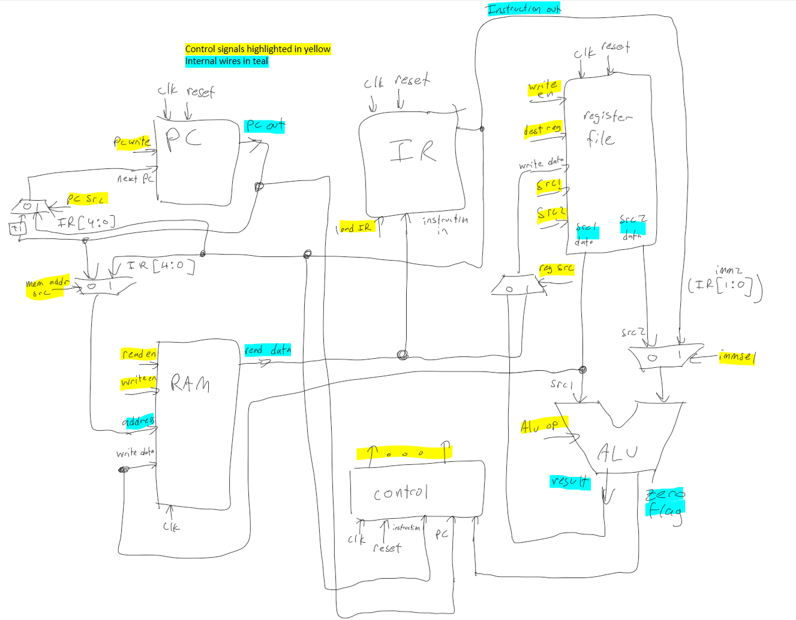
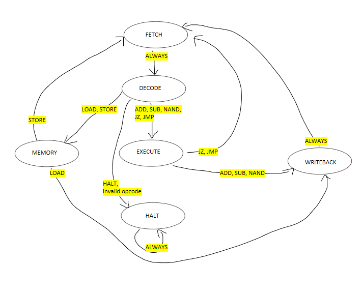

# Custom 8-bit Verilog CPU

## Overview

This project implements a simple 8-bit CPU in Verilog with a compact instruction set architecture (ISA), 4 general-purpose registers, a central 8-bit RAM, and an ALU supporting three operations. The design primarily uses multiplexer logic within the top-level module to send values.

The CPU fetches instructions from RAM, decodes them, performs ALU or memory operations, and updates its program counter (PC) accordingly. Instructions are executed over multiple clock cycles, with each state in the control FSM taking one clock cycle.

---

## Key Features

* 8-bit word size
* 3-bit opcodes
* 4 general-purpose registers (`R0` to `R3`)
* Combined 256-bit RAM (32 words of 8 bits)
* Designated destination register `R0` for LOAD and STORE
* MUX logic for data transfers
* Conditional and unconditional branching
* FSM-based control unit
* Support for immediate values
* Minimal module breakdown

---

## Instruction Set Architecture (ISA)

Each instruction is 8 bits wide.

### ALU Instructions

Use `src1` as the destination.

* Format: `[7:5] opcode | [4] immsel/padding | [3:2] src1 | [1:0] src2_or_imm2`

| Opcode | Mnemonic | Description              |
| ------ | -------- | ------------------------ |
| 000    | ADD      | src1 = src1 + src2/imm2  |
| 001    | SUB      | src1 = src1 - src2/imm2  |
| 010    | NAND     | src1 = \~(src1 & src2)   |

> Note: `immsel = 1` selects the 2-bit immediate `imm2` instead of `src2`.

### Non-ALU Instructions

Use direct RAM addressing. STORE and LOAD use R0 to read/write.

* Format: `[7:5] opcode | [4:0] address`

| Opcode | Mnemonic | Description                    |
| ------ | -------- | ------------------------------ |
| 011    | LOAD     | R0 = RAM\[address]             |
| 100    | STORE    | RAM\[address] = R0             |
| 101    | JMP      | PC = address                   |
| 110    | JZ       | If Zero flag set, PC = address |
| 111    | HALT     | Stop execution                 |

---

## Modules

### 1. `top.v`

Top-level integration. Coordinates datapath, control, PC, IR, ALU, register file, and RAM. Contains the overall wiring and MUX logic.

### 2. `alu.v`

Performs ADD, SUB, NAND based on `alu_op`.

* Inputs: `src1`, `src2`, `imm2`, `imm_sel`, `alu_op`
* Output: `result`, `zero_flag`
* Besides the 3 operations, ALU takes in 2'b11 as its default state ALU_NULL, where result and zero flag are not updated.
* Updates asynchronously.

### 3. `register_file.v`

4 registers, 8 bits each. R0 is always source/destination register for STORE/LOAD.

* Inputs: `clk`, `write_enable`, `src1`, `src2`, `dest_reg`, `write_data`, `reset`
* Outputs: `src1_data`, `src2_data`
* 4 8-bit general purpose registers.
* Written to during WRITEBK state.
* Synchronus writes and asynchronous reads.

### 4. `ram.v`

32 x 8-bit RAM, addressable via 5-bit address.

* Inputs: `clk`, `read_en`, `write_en`, `address`, `write_data`
* Output: `read_data`
* 5 bit address (32 addresses) storing 8 bits each.
* Manually accessed during MEM state, automatically accessed at FETCH to retrieve instruction.
* Synchronus writes and asynchronous reads.

### 5. `pc.v`

5-bit Program Counter

* Inputs: `clk`, `reset`, `pc_write`, `next_pc`
* Output: `pc_out`
* Stores one 5 bit address.
* Iterates at FETCH, so always 1 ahead of current instruction's address.
* Updates synchronously.

### 6. `instruction_register.v`

Holds current instruction.

* Inputs: `clk`, `reset`, `load_ir`, `instruction_in`
* Output: `instruction_out`
* Holds current 8 bit instruction.
* Updates during FETCH.
* Updates synchronously.

### 7. `control_unit.v`

Finite State Machine that:

* Inputs: `clk`, `reset`, `instruction`, `zero_flag`, `pc`
* Decodes opcode.
* Automatically halts execution after instruction at address 5'b11111 if no halt prior.
* All control signals are reset to default values between state transitions.
* Generates control signals (see below).

---

## Architecture

Module inputs and outputs are directly connected, sometimes with MUXs to select an input. The following inputs are decided by MUX logic.

* PC source (pc_src)
* Memory address (mem_addr_src)
* Register write data (reg_src)
* ALU immediate select (imm_sel, integrated into the ALU module)

---

## Control Unit Inputs and Signals

| Signal              | Description                                                                                | Size |
| ------------------- | ------------------------------------------------------------------------------------------ | 1    |
| `pc_write`          | Enable writing/updating the Program Counter (PC)                                           | 1    |
| `pc_src`            | Select source for PC next value (PC + 1 for normal next, or jump address for JMP/JZ)       | 1    |
| `ir_write`          | Enable loading the Instruction Register (IR) with the fetched instruction                  | 1    |
| `reg_write`         | Enable writing data to the register file                                                   | 1    |
| `reg_src`           | Select source for register file write data (ALU output or RAM)                             | 1    |
| `reg_dest`          | Select destination register (LOAD/STORE for R0, src1 for ALU ops)                          | 2    |
| `alu_op`            | ALU operation code to specify which ALU function (ADD, SUB, NAND)                          | 2    |
| `alu_src1`          | Select first ALU operand register                                                          | 2    |
| `alu_src2`          | Select second ALU operand register (if imm_sel = 0)                                        | 2    |
| `imm_sel`           | Select second ALU operand type (0 for register, 1 for zero extended 2 bit immediate)       | 1    |
| `mem_read`          | Enable read from RAM (for LOAD or instruction fetch)                                       | 1    |
| `mem_write`         | Enable write to RAM (for STORE)                                                            | 1    |
| `mem_addr_src`      | Select address for RAM access (PC for instruction fetch or IR for data access)             | 1    |

---

## Instruction Cycle

1. **Fetch**:

   * PC addresses RAM
   * Load instruction into IR
   * Increment PC unless overwritten (JMP/JZ)

2. **Decode**:

   * Decode `opcode` from IR
   * Set next state accordingly

3. **Execute**:

   * ALU op → result stored in R0
   * LOAD/STORE interact with RAM
   * JMP/JZ update PC

4. **Memory**:

    * Select IR\[4:0] for RAM address input
    * Enable read on LOAD
    * Enable write on STORE

5. **Writeback**:

    * Set control signals so LOAD always writes to R0
    * Set control signals so ALU operations always write to src1 (IR\[4:3])
---

## Limitations and Future Work

### Limitations
* No interrupt handling
* No hazard detection
* Fixed 5 bit PC/RAM

### Possible improvements
* Increase word/instruction size & larger opcode
* Implement pipelining optimizations
* Add stack support (PUSH/POP)
* Add software traps
* Power optimization (disabling unused modules, FSM encoding, resource sharing)
* Develop custom assembler for the ISA (assembly, C)
* Develop custom interactive debugger
* FPGA implementation
* Implement internal bus for wiring simplicity

---

## Notes

* Immediate values (`imm2`) are zero-extended to 8 bits.
* `R0` acts as the sole source/destination for STORE/LOAD.
* All instructions are 8 bits and execute by performing a single instruction cycle step per clock cycle.
* RAM is dual-use: instruction and data memory. We suggest using addresses after the HALT instruction to store 8 bit data.
* PC always starts at 0 at the start of program execution.
* A reset signal is sent at the start of program execution.
* CPU automatically enters HALT after executing instruction 31 (address 11111), preventing variables from updating after instruction 31's execution.
* ALU output and RAM output use implicit registers (not shown in datapath) to store values that would otherwise be cleared during the state transition to WRITEBK.
* To simulate, change the program filepath in ram.v and run the testbench for the top level module.
* This project was tested using Intel Quartus Prime Lite 24.1 and ModelSim-Intel Starter Edition 18.1.

---

## Contact
Email: tylerli3@illinois.edu
